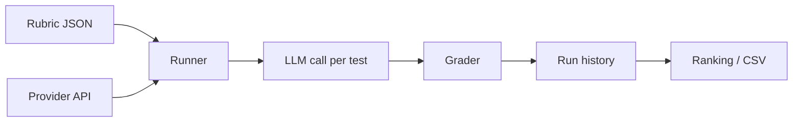

# LLM Eval Lab

A **single-file, browser-based evaluation harness** for testing LLM outputs against rubrics. No install, no server — open the HTML file, add your API keys, pick a rubric, and run.

Open **`llm-eval-lab.html`** in your browser (version is tracked in the app header and git tags, not the filename).

## What it does

LLM Eval Lab lets you:

- Run a **rubric** (a suite of prompts + graders) against any configured model provider
- Compare models using **pass rate**, **latency**, **token usage**, and **estimated cost**
- Build **Needle-in-a-Haystack (NIAH)** long-context rubrics with a visual builder
- Score open-ended answers with an **LLM-as-judge** grader
- Pre-fetch **web search** results and inject them into prompts (Tavily or Brave)
- Load rubrics from **JSON files**, paste, or a **local folder** (Chrome/Edge File System Access API)
- Export **run history** as JSON or CSV, and view a **ranking dashboard** across past runs

Everything runs locally in your browser. API keys are stored in `localStorage` only — they never leave your machine except when calling the providers you configure.

## Quick start

1. Clone or download this repo.
2. Open `llm-eval-lab.html` in a modern browser (Chrome, Edge, or Firefox recommended for folder loading).
3. In **PROVIDERS**, enter your API key(s):
   - **OpenRouter** — access many hosted models via one key
   - **LM Studio** — local OpenAI-compatible server (default `http://localhost:1234`)
4. Optionally configure **LLM-as-judge** (provider + model) for subjective rubrics.
5. In **RUNNER**, select a built-in sample rubric (e.g. *Basic Sanity*), choose provider + model, and click **RUN RUBRIC**.

Built-in sample rubrics cover sanity checks, instruction following, Python output prediction, judged quality, and search-augmented tests.

## How it works



For each test in a rubric:

1. **Optional search** — If the test has a `search` field, the app queries Tavily or Brave and prepends results to the prompt.
2. **Model call** — Messages are sent to the selected provider (system prompt from rubric, test, or override).
3. **Grade** — The response is checked with the test’s grader (`exact`, `regex`, `llm-judge`, etc.).
4. **Record** — Pass/fail, score, latency, tokens, and cost are appended to the live stream and saved to history.

Runs are **sequential** (one test at a time). Use **STOP** to cancel mid-rubric.

## Panels overview

| Panel | Purpose |
|-------|---------|
| **Providers** | API keys, search keys, LLM-as-judge config, pricing refresh |
| **Runner** | Select rubric, provider, model, temperature; run and stream results |
| **Rubrics** | Import/export JSON, load a folder of `.json` rubrics |
| **NIAH Builder** | Generate long-context needle-in-haystack rubrics |
| **Rubric Editor** | Create and edit rubrics and tests in the UI |
| **Run History** | Past runs, per-test detail, CSV/JSON export |
| **Ranking** | Aggregate pass rate and cost by provider + model |

## Providers

| ID | Label | Notes |
|----|-------|-------|
| `openrouter` | OpenRouter | Hosted models; pricing fetched from OpenRouter’s public models API |
| `lmstudio` | LM Studio | Local server; cost shown as $0 |

Model IDs are free text (e.g. `anthropic/claude-sonnet-4.5` on OpenRouter).

## Graders

| ID | Use for |
|----|---------|
| `exact` | String equality (optional case fold) |
| `contains` | Substring(s); `params.mode`: `all` or `any` |
| `regex` | Pattern match; `params.flags` for RegExp flags |
| `starts-with` | Prefix match |
| `numeric` | Parse a number from output; `params.tolerance` |
| `json-equal` | Deep JSON equality (strips markdown fences) |
| `length` | Character count bounds (`params.min` / `params.max`) |
| `llm-judge` | Subjective scoring via judge model; requires `params.criteria` |

**LLM-as-judge** needs a judge provider and model set under Providers. The judge returns JSON `{ pass, score, reason }`; tests pass when `score >= params.threshold` (default `0.7`).

## Rubric format

```json
{
  "id": "my-rubric",
  "name": "My Rubric",
  "description": "Optional summary",
  "system": "Optional system prompt for all tests",
  "tests": [
    {
      "id": "test-1",
      "prompt": "What is 2 + 2? Reply with only the number.",
      "expected": "4",
      "grader": "exact",
      "params": { "caseSensitive": false },
      "max_tokens": 50,
      "search": {
        "query": "optional explicit query",
        "topK": 5,
        "provider": "tavily"
      }
    }
  ]
}
```

Import via paste, file picker, or **LOAD FOLDER** (all `*.json` files in a directory). Folder-linked rubrics reload from disk on refresh; edits in the editor apply to user-saved rubrics in `localStorage`.

## NIAH (Needle in a Haystack)

The NIAH builder stress-tests **retrieval in long context**:

- **Context length** — Slider from 1k to 250k tokens (approximate; ~4 chars per token)
- **Depth samples** — Place the “needle” at 1, 3, 5, or 10 depths through the haystack
- **Needle / question / keywords** — Hidden fact, question, and expected keywords (`contains` grader)

Click **GENERATE RUBRIC**, then run it from the Runner like any other rubric. Cost estimates use the model selected in Runner and OpenRouter pricing when available.

> **Note:** NIAH rubrics embed full haystack text in each test **at run time**. Only a compact **recipe** (length, depths, needle, keywords) is saved to `localStorage` and rebuilt on reload — not the full prompts.

## Search providers

| ID | Config |
|----|--------|
| `tavily` | API key at [tavily.com](https://tavily.com) |
| `brave` | API key at [Brave Search API](https://brave.com/search/api/) |

Tests with a `search` field fetch results before the model sees the prompt. The sample *Search-Augmented · Current Info* rubric depends on live web data and may be flaky over time.

## Data & privacy

- **API keys** — `localStorage` (`llm-eval-lab.v0.1` key)
- **Run history** — Last 100 runs in `localStorage`
- **User rubrics** — Saved in `localStorage` (not full NIAH haystacks recommended at max size)
- **Rubric folder handle** — `indexedDB` (for “remember this folder” across sessions)

Clear history with **CLEAR** in Run History. Keys are only sent to the APIs you configure.

## Exports

- **CSV · SUMMARY** — One row per run (pass rate, tokens, cost)
- **CSV · DETAIL** — One row per test
- **JSON** — Full run history dump

## Dev mode

Append `?dev=1` to the URL to enable panel reordering (SortableJS) and a layout export button.

## Roadmap (from in-app comments)

- **v0.2** — LLM-as-judge, rubric folder loader *(in progress; UI still labeled v0.1 in places)*
- **v0.3** — Cost tracking, CSV, ranking *(largely present)*
- **v0.4** — Web search suites, tool-call evals, richer NIAH
- **Future** — Anthropic direct, local folder adapter, tiktoken-accurate token counts

## Requirements

- Modern browser with `fetch` and `localStorage`
- **Folder loading / restore:** Chromium-based browsers (File System Access API)
- Network access for provider, search, and OpenRouter pricing endpoints

## License

No license file is included yet. Add one if you plan to distribute or accept contributions.
